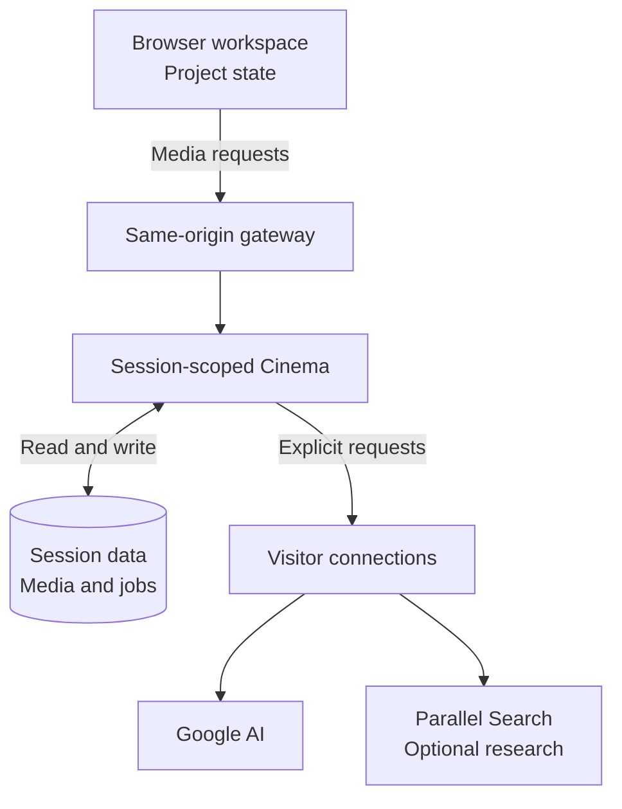

ReelBinder has a browser editor and a same-origin media-service boundary. The editor owns creative state; the hosted Cinema service manages session-scoped connections, media and jobs.

The browser keeps the editable Project; Cinema manages session data, media and jobs behind the gateway. Each visitor connects their own services. Requests do not fall back to the server owner's credentials. Parallel supports optional research, while FFmpeg assembles picture and sound without an AI connection.

| Layer | Responsibilities |
|---|---|
| React and TanStack Start | Script, Stage, Frame, playback, editing and user controls |
| Zustand Project state | Authored edits, persistence, undo and Project replacement |
| Same-origin Cinema gateway | Routes editor requests to the media service |
| Hosted Cinema service (not included here) | Session isolation, connection expiry, job admission, assets and rendering |
| Google ADK and provider adapters | Assistant workflows and explicitly requested generation |
| Parallel Search | Research used by supported assistant workflows |
| FFmpeg | Picture-and-sound render assembly |

## Keep creative state connected

The Project holds screenplay elements, setups, catalog identities, media versions and edit timelines. Stable identifiers connect those artifacts without treating them as interchangeable.

Coverage describes the story span a setup can shoot. Timeline clips describe the ordered source excerpts used in the film. Catalog identities are shared while scoped notes describe local exceptions.

## Treat media as data

Media records retain byte sizes, checksums and lineage. Portable imports verify embedded bytes and restore them into a receiving session. Session-local references can change without relabeling historical provider operations.

Generation and render jobs record their state and link completed requests to media outputs. Use that state to track a request, then review and keep its output with your Project.

## Separate appearance from film

Application appearance preferences belong to the editor, not the screenplay or exported film Project. This keeps a change in theme from changing the creative artifact.

For interchange details, read the [Project format overview](/slate-format).
