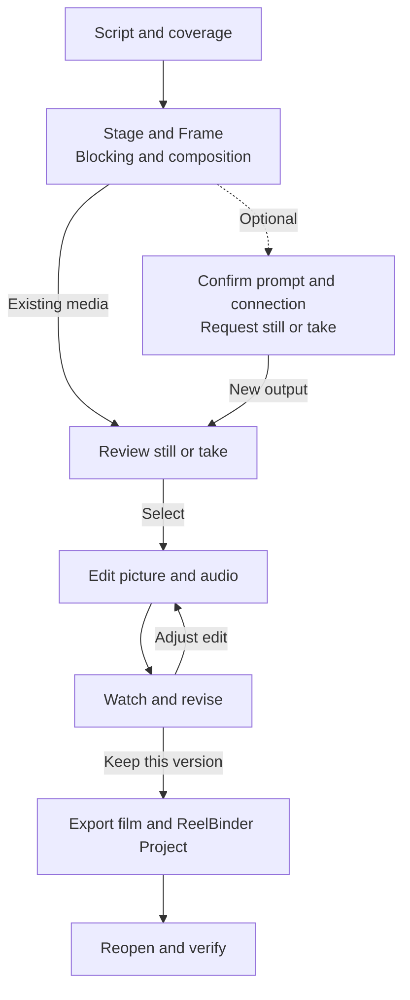

Use this path to develop a scene, choosing existing material or requesting new media when you need it.

Each generation request is a separate action using your provider connection. Review a still before requesting video from it; a composition proposal does not start a video job. You can return to an earlier step whenever the scene needs work. The sections below describe the same path in text.

## 1. Start with a screenplay

Create a blank film or import your screenplay or saved Project. Review the text before adding production detail. Script elements have stable identities that connect coverage, marks and discussions to the story.

Mark characters, props and other production items in context. A catalog item can have a global note plus scene- or setup-specific notes, so a local exception does not have to replace the shared description.

## 2. Plan coverage

Define setups around the story beats they cover. A master setup can span a scene while other setups cover selected moments. Overlapping coverage is useful: it describes your shooting options.

Use Stage to work with blocking and shot settings, and Frame to develop composition. Keep shot descriptions and selected references consistent with the intended action.

## 3. Review and generate

Use discussions and Assistant to develop specific, editable direction. Review proposals before applying them. A generation request should have the intended reference, prompt and provider connection selected.

Review a generated still before turning it into a take. Where available, Apply Frame composition uses a selected clean still and a composition guide; video generation is a separate request using its selected reference.

## 4. Assemble picture and sound

Choose takes, trim source ranges and arrange excerpts in Edit. The ordered edit is separate from coverage: a setup can cover many beats without appearing as one continuous clip in the film.

Check playback and transitions, adjust native take audio, and add sound cues as needed. Listen to the rendered result as well as the preview. Review performance, continuity and pacing in the rendered result.

## 5. Save both deliverables

Keep the rendered movie for viewing and a portable Project archive for continued editing. See [Projects and exports](/projects-and-exports).
